# VIDHI — Tamil Horror FPS

A browser-playable horror FPS rendered with WebGL (Three.js). You return to
your grandfather's village and descend into a sealed kovil where *vidhi*
(fate) sleeps — torch-lit stone corridors, fog, asuras in the dark, and
Mahishasura waiting in the inner sanctum.

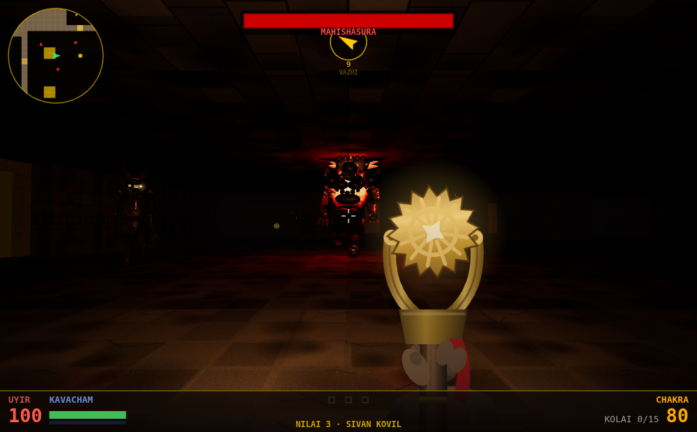

Everything you see is generated in code at load time. The repo ships **zero
image assets** — walls, monsters, weapons and effects are all built from
procedural textures and procedural geometry. (The pictures in this README are
the exception: they are screenshots, captured from the game itself by
[`tools/capture.mjs`](tools/capture.mjs).)

## Play

Visit the GitHub Pages deployment for this repo. Works on desktop
(mouse + keyboard) and phones (virtual joystick + swipe look). No build step —
serve the folder and open `index.html`:

```sh
python3 -m http.server
```

## Controls

### Desktop
- **WASD** — Move / strafe
- **Mouse** — Look (click to capture)
- **Left Click** — Fire
- **1–4** — Switch weapons
- **E** — Open doors and secret walls
- **M** — Padam (map) &nbsp; **ESC** — Pause

### Phone
- **Left thumb** — Virtual joystick (move/strafe)
- **Right thumb** — Swipe to look
- **FIRE / WPN / E / MAP** — On-screen buttons

---

# Weapons

Four weapons, drawn as first-person viewmodels on the HUD canvas. Only the
trishul is yours from the start; the rest are found in the temple, and the
Brahmastra is prised off Mahishasura's corpse.

| # | Weapon | Type | Damage | Range | Rate | Ammo |
|---|--------|------|--------|-------|------|------|
| 1 | **Trishul** | Hitscan melee | 18 | 3 tiles | 0.35 s | Infinite |
| 2 | **Agni** | Hitscan spread, 5 pellets | 45 total | 7 tiles | 0.80 s | 50 max |
| 3 | **Sudarshana Chakra** | Projectile (11 tiles/s) | 30 | 14 tiles | 0.30 s | 100 max |
| 4 | **Brahmastra** | Explosive projectile (6 tiles/s) | 100 + splash | 20 tiles | 1.50 s | 20 max |

### 1 · Trishul — *the trident*

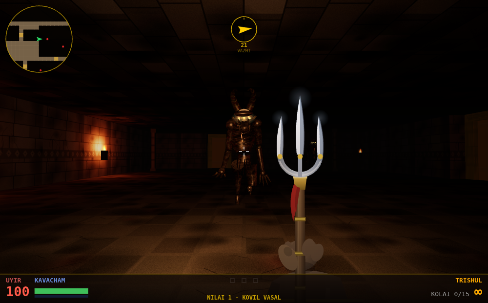

Shiva's trident, and the only thing your grandfather left you. Infinite ammo,
short reach, and enough punch to open an asura at arm's length. It stays
useful all game because ammo for everything else is scarce.

### 2 · Agni — *the fire-lance*

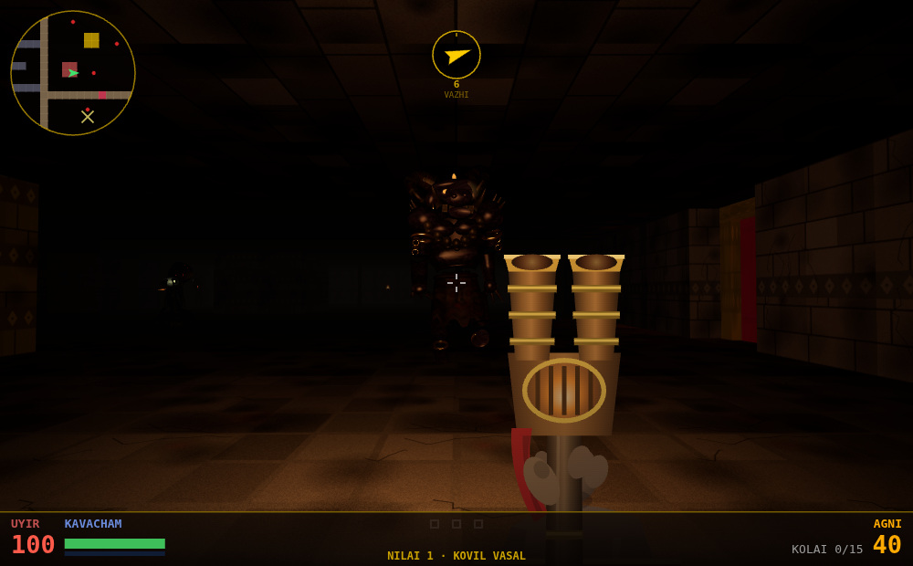

A twin-throated bronze horn with a live ember chamber. The 45 damage is split
across five pellets in a tight cone, so you only get all of it by being close
enough that every pellet lands — devastating inside a doorway, wasted across a
hall. The bores glow hotter for a moment after each shot.

### 3 · Sudarshana Chakra — *the discus*

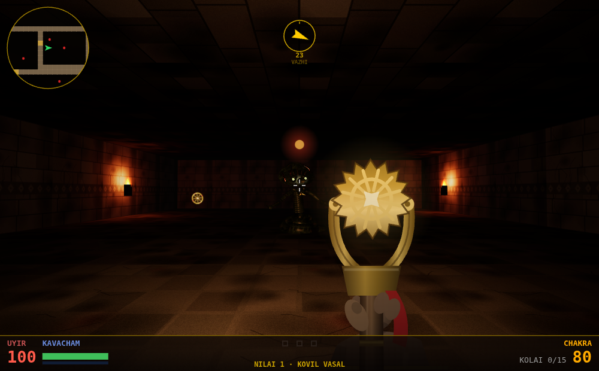

Vishnu's discus, fed one blazing wheel at a time from a gold cradle. Travelling
projectiles rather than hitscan, so you have to lead moving targets — but the
fire rate is the fastest in the game and the disc carries the length of a hall.

### 4 · Brahmastra — *the last resort*

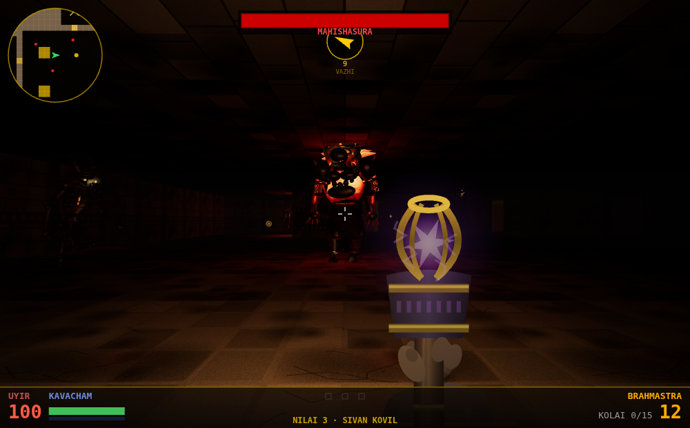

A caged star that should never have been bound. Slow, loud, and explosive —
it will take a knot of enemies apart, and it will take *you* apart if you fire
it at a wall you are standing next to. Dropped by Mahishasura, along with the
gold key.

---

# Monsters

Enemies are **real 3D geometry**, not billboards: every monster is a rigged
tree of body parts built from swept tubes and primitives
([`src/models3d.js`](src/models3d.js)), lit by the same torches as the level
and posed every frame from the simulation's state — a walk cycle driven by how
fast it is actually travelling, a rear-back that builds through the wind-up,
and a death that topples the body and sinks it into the floor.

A swept tube on its own reads as inflatable, so nothing keeps the shape it was
authored with:

- **Flesh noise** pushes every skin vertex along its normal before the mesh is
  frozen, biased so troughs cut deeper than peaks. It breaks the *silhouette*,
  not just the shading — no limb is a smooth cylinder any more.
- **Cavity occlusion** is baked from that same noise into vertex colours, so
  creases stay dark whichever way the torches are pointing. Free at runtime,
  and it is what stops the surface looking like moulded plastic.
- **Wet-flesh shading** — a small, dim, tight highlight over a desaturated
  base, plus a cold fresnel rim so a body separates from the fog instead of
  dissolving into it.
- **Nothing is symmetrical.** Left and right are displaced with different noise
  seeds, and every joint carries a fixed offset and twist. Three sculpt
  variants are baked per species and instances pick one at random, on top of
  per-instance shifts in stature, tone and gloss — so a room of asuras is a
  pack, not one model stamped out nine times.
- **They cast shadows.** A spotlight down the player's view carries a shadow
  map that only the enemies write into, so a monster throws a shadow onto the
  wall behind it. The renderer watches its own frame time and drops shadows if
  the machine cannot hold 30fps with them on.

Level 3 — fifteen enemies plus the boss — renders in 273 draw calls.

### Asura — *the swarm*

| | Idle | Winding up |
|---|---|---|
| <sub>Fast, fragile, arrives in numbers</sub> | 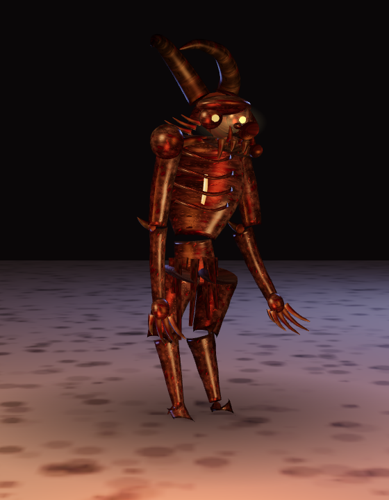 | 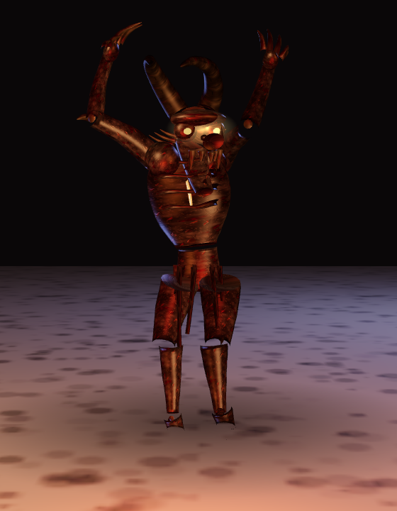 |

A starved, hunched ghoul: digitigrade legs, a ribcage you can count, arms that
nearly drag, and a fire burning somewhere behind the sternum that shows as
cracks in the charred hide. It closes fast and hits weakly, so the danger is
always the third and fourth one behind it.

**40–60 HP · 1.6–2.0 tiles/s · 8–12 damage · melee**

### Naga — *the ranged threat*

| | Idle | Striking |
|---|---|---|
| <sub>Holds its distance and spits venom</sub> | 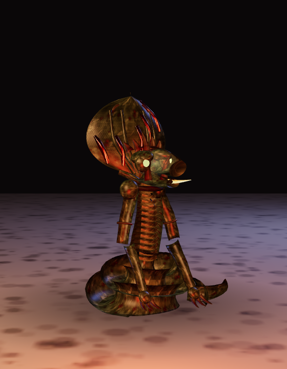 | 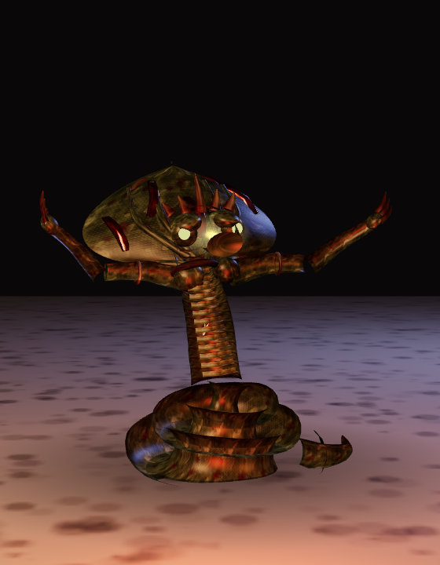 |

A serpent warrior coiled on the floor, torso raised, cobra hood spread behind a
crowned viper skull. It refuses to close: once it has line of sight between
about 2 and 7 tiles it holds station and spits venom, so it punishes you for
standing still in the open. The hood flares wide as the strike winds up — that
flare is your cue to break line of sight.

**60–100 HP · 1.2–1.4 tiles/s · 10–14 damage · ranged venom**

### Rakshasa — *the wall*

| | Idle | Winding up |
|---|---|---|
| <sub>Slow, armoured, hits like a truck</sub> | 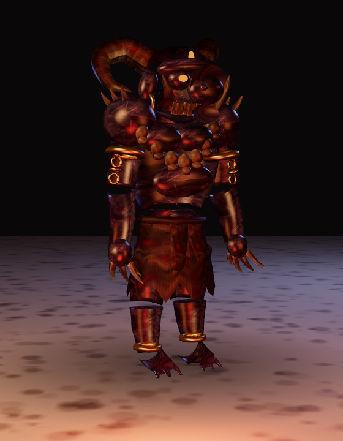 | 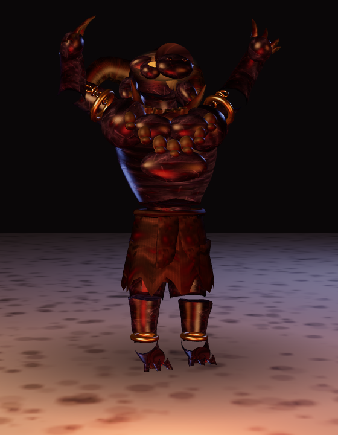 |

A slab of a demon: ram-curled horns, tusks up the outside of the snout, a
garland of skulls, gold armlets and anklets over a red dhoti, and three burning
eyes. Slow enough to outrun, strong enough that two hits will end a careless
run. Save the Agni for these.

**100–150 HP · 1.0–1.1 tiles/s · 20–25 damage · melee**

### Mahishasura — *the boss*

| | Idle | Roaring |
|---|---|---|
| <sub>Wakes without needing to see you</sub> | 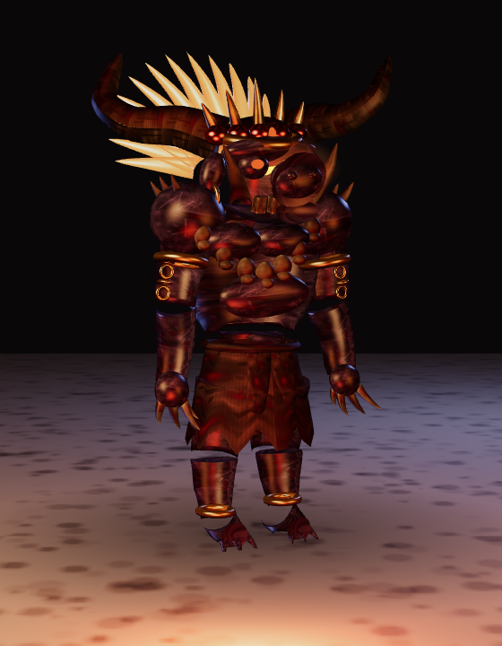 | 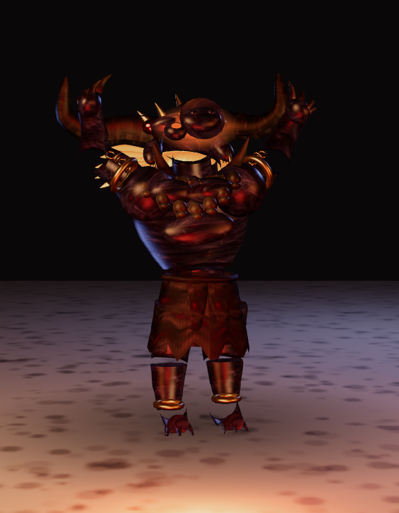 |

The buffalo demon, waiting in the inner sanctum of the Sivan Kovil. Wide
sweeping horns, a crown of gold spikes, a mane of fire that lights the arena
around him — he carries his own point light, so you can watch the pillars come
out of the dark as he turns toward you. He wakes at 16 tiles without needing
line of sight, so there is no sneaking up on him, and his reach is longer than
anything else in the temple.

**650 HP · 0.9 tiles/s · 35 damage · 2.5-tile reach · carries the gold key**

---

# Levels

Three hand-authored 32×32 tile maps, defined as character grids in
[`src/maps.js`](src/maps.js). Locked doors need matching keys; secret walls
(press **E** on suspicious stone) hide armour and supplies. The maps below are
drawn straight from that grid data, so they cannot drift out of date.

### Nilai 1 — Kovil Vasal *(Temple Entrance)*

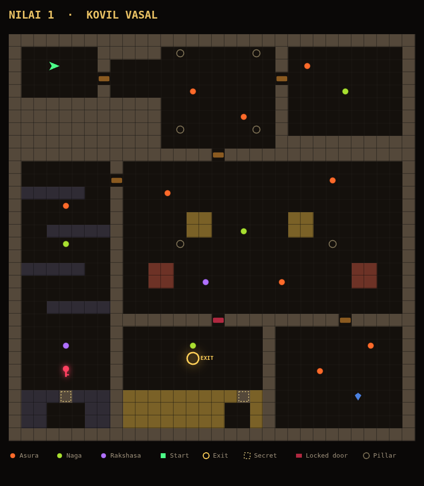

Entry rooms open into a pillared gate hall and then a grand courtyard of red
and gold blockwork. The **red key** lies at the bottom of a dark crypt down the
west side; the red door on the south wall guards the way out. Two secret walls
in the south-west crypt and the gold hall.

**15 enemies** (9 asura, 4 naga, 2 rakshasa) · **2 secrets** · red key · warm
fog, brightest level of the three.

### Nilai 2 — Irulil Nadai *(Walk in Darkness)*

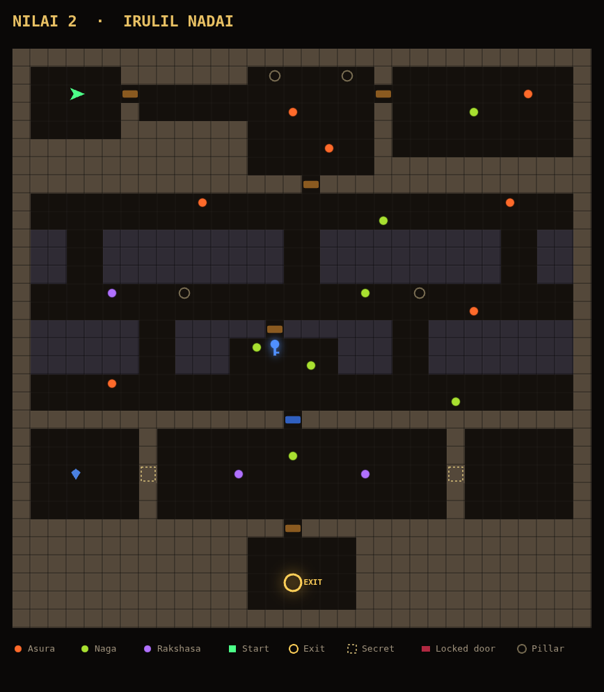

Near-black catacombs: a lattice of dark stone pillars with long sightlines
between them, which is exactly what the nagas want. The **blue key** sits in a
sealed vault at the heart of the maze. The two secret walls flank the southern
chamber and hold the armour you will want before the last level.

**17 enemies** (7 asura, 7 naga, 3 rakshasa) · **2 secrets** · blue key ·
the darkest ambient light and the heaviest fog in the game.

### Nilai 3 — Sivan Kovil *(Shiva's Temple)*

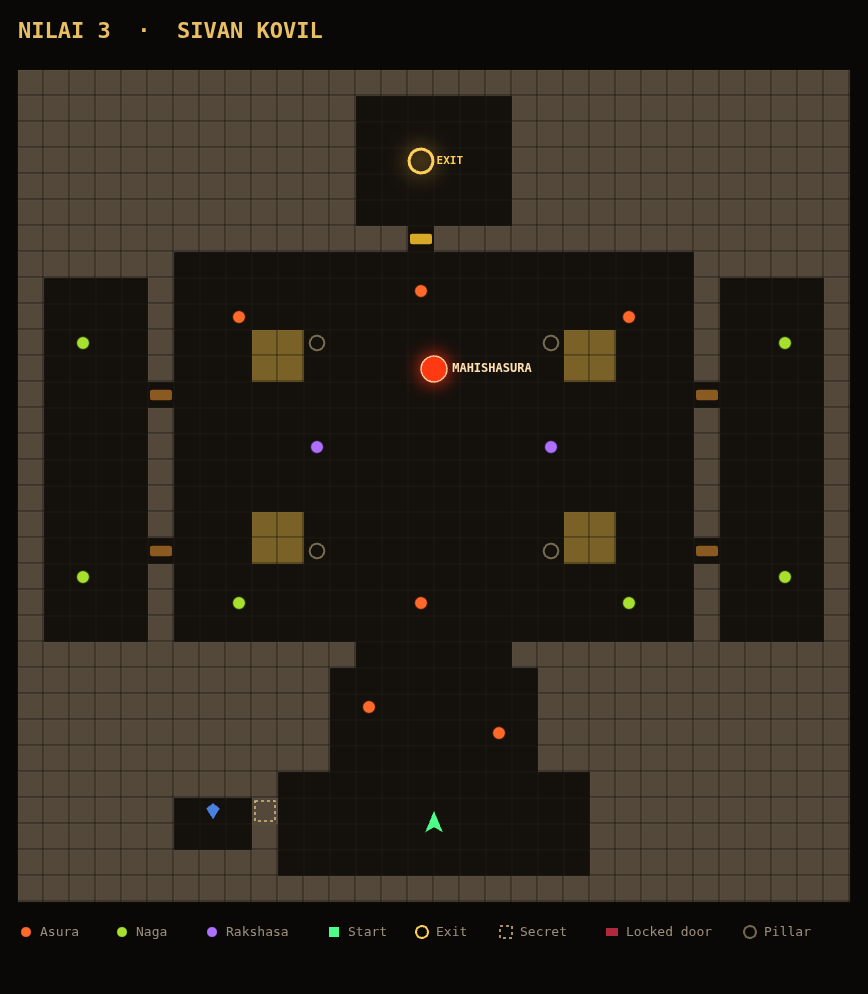

A processional approach from the south opens into a vast pillared arena with
side galleries. Mahishasura holds the **gold key**; the sanctum door to the
north opens only with it, so the boss is not optional. Nagas are posted in the
outer galleries to shoot into the arena while you fight him — clear them first
if you can.

**15 enemies** (6 asura, 6 naga, 2 rakshasa, **Mahishasura**) · **1 secret** ·
gold key · the fight itself is the level.

---

# Tech

- **Rendering** — Three.js (vendored in `lib/`, no build step): merged
  tile-grid wall geometry, procedural canvas textures, a pooled torch-light
  system with flicker and random outages, exponential fog, ACES tone mapping.
- **Monsters** — procedural rigged 3D models built from swept tubes, then
  noise-displaced and cavity-occluded at bake time (`src/models3d.js`).
  Geometry is baked once per species variant and shared across every instance;
  materials are cloned per instance so a single monster can flash red on a hit
  or fade out as a corpse. Sculpted glTF models can replace any species — see
  below.
- **Shadows** — one spotlight down the player's view carries the shadow map,
  written only by enemies, with an automatic fallback if the frame budget
  cannot take it.
- **Simulation** — the game logic in `src/game.js` is still 2D and tile-based;
  the renderer is a pure view layer that maps game `(x, y)` onto scene
  `(x, height, z)`.
- **Audio** — fully procedural Web Audio: weapon SFX, a looping horror drone,
  alert stingers, a low-health heartbeat.
- **Art** — every texture, sprite and model is generated at load time. No image
  files are loaded by the game.

### Using sculpted models instead

Procedural geometry has a ceiling. The detail that makes a creature genuinely
frightening — pores, sagging skin, asymmetric growths, real muscle flow — comes
from a sculpt, not from math. So the renderer will take one if you have one.

Drop a `.glb` next to the game and name it in
[`src/monsterAssets.js`](src/monsterAssets.js):

```js
export const MONSTER_MODELS = {
  asura: {
    url: 'assets/monsters/asura.glb',
    clips: { idle: 'Idle', walk: 'Walk', attack: 'Attack', death: 'Death' },
  },
};
```

That is the whole integration. [`src/monsters.js`](src/monsters.js) fits the
model to the species' gameplay height, stands it on the floor, clones its
skeleton per instance, and drives its animation clips from the same state the
procedural poser uses. Anything you leave unconfigured stays procedural, so you
can sculpt one monster at a time. A model that fails to load logs a warning and
falls back rather than taking the game down.

Sculpts can come from AI generation (Meshy, Tripo, Rodin), a marketplace
(Sketchfab, itch.io), or Blender — plus Mixamo if you need the clips. Requirements
are in the comments at the top of `monsterAssets.js`.

Note that adding one costs the repo its "no image assets, no build step"
property, and the `.glb` will dwarf everything else in here. That trade is
yours to make; the default ships procedural.

### Layout

```
src/models3d.js   procedural rigged monsters (geometry, skin, displacement)
src/monsters.js   monster factory: sculpted glTF when present, procedural otherwise
src/monsterAssets.js  where you name optional .glb sculpts (empty by default)
src/renderer3d.js Three.js scene: level geometry, lights, shadows, monsters
src/sprites3d.js  billboard art for pickups, flames, projectiles
src/textures.js   procedural wall/floor/ceiling textures
src/game.js       simulation: movement, combat, AI, pickups
src/maps.js       the three level grids and their spawns
src/hud.js        HUD and first-person weapon viewmodels
src/sound.js      procedural Web Audio
tools/            offline capture rig for the images in this README
```

### Regenerating the README images

The screenshots above are produced from the game's own code, so they stay
honest after an art change. With Playwright installed:

```sh
node tools/capture.mjs
```

That launches the real game and the model turntable in headless Chromium and
rewrites `docs/img/`. Set `PW_CHROMIUM` to point at a specific Chromium build,
and `PW_MODULE` if Playwright is installed somewhere other than this project.
